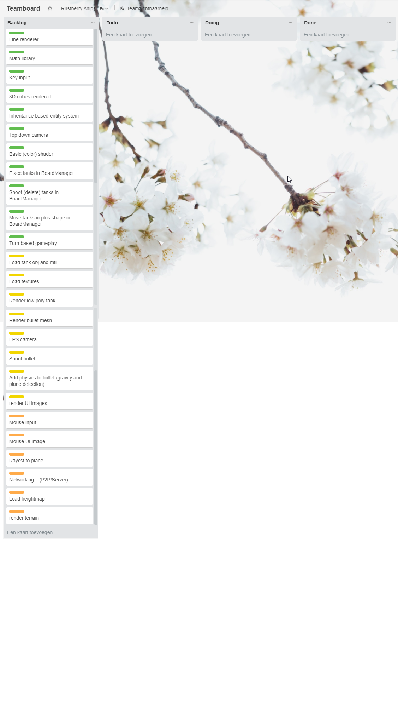

# Teamwork for the project
We started by outlining what we wanted the gameplay to be:

```
Gameplay:

Grid place/move/rotate. Shoot via “Physics” grid=shootpos. Turn based. Landships, Low poly. Networking 10*20 grid
```

## Deliverables:
Then we setup goals for each stage, so we had a basic idea of what we needed to do for each prototype.

### Stage 1:
1.	Plane with a grid.
2.	Cubes as Tanks
3.	Cube as shell
4.	Movement is teleport one tile from current position. No rotation
5.	Top down camera
6.	Click to shoot at grid
7.	Keyboard tile selection
8.	Single player
9.	Inheritance based system 

### Stage 2:
1.	Low poly tanks
2.	Bullet mesh
3.	Firs person camera
4.	Shooting of bullet in “Physics”
5.	UI system: have pictures as overlay

### Stage 3:
1.	Ray casting to select tanks
2.	Networking
3.	Terrain
4.	Skybox
 
### Stage 4:
1.	Animated tanks
2.	Texture blending on terrain
3.	More scenery
4.	Custom tile map blocking.

## Individual tasks (trello)
Then diveded each of the deliverables into smaller tasks and put them into trello:


## Wiki page
Then we put that information as a "planning" page in [the github wiki](https://github.com/simonrenger/RustberryShips/wiki/Planning)
